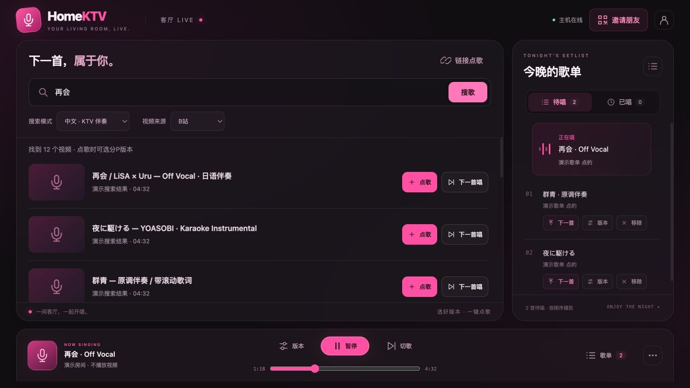
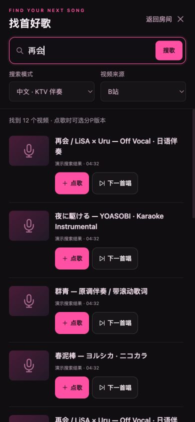
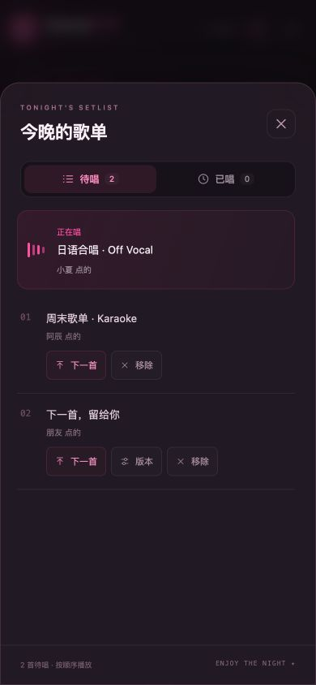
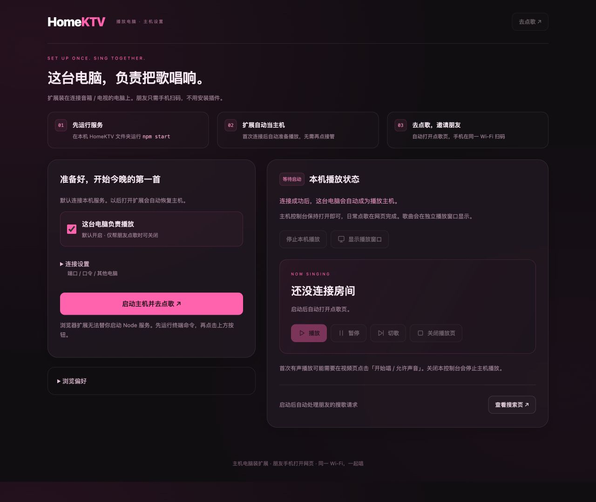

<div align="center">

# 🎤 HomeKTV

### 把客厅，唱成现场。

**一台电脑负责播放，朋友们用手机点歌。**<br>
把 B站和 YouTube 的伴奏放进同一张歌单，今晚轮到谁，大家说了算。


[看看界面](#preview) · [支持的平台](#platforms) · [快速开唱](#quick-start) · [功能与来源](#features) · [遇到问题](#faq)

</div>



> 带上电脑、音箱和你的拿手歌。主机运行 HomeKTV，并用浏览器扩展播放原视频网站；朋友连接同一 Wi-Fi，扫码打开网页就能点歌。**无需手机 App，无需搜索 API Key。视频播放仍需主机联网访问 B站 / YouTube。**

<a id="preview"></a>

## 先看看，今晚怎么唱

| 你想做的事 | HomeKTV 怎么帮你 |
| --- | --- |
| 朋友聚会，不想轮流抢电脑 | 每个人用自己的手机搜歌、点歌，歌单一起看 |
| 中文金曲和日语歌都想唱 | 切换 KTV 伴奏、ニコカラ、普通视频搜索模式 |
| B站找不到，想换个地方搜 | 切换 YouTube，两个来源排进同一队列 |
| 前奏太长，想直接进主歌 | 点击或拖动进度条；暂停状态下也能调整位置 |
| 想再唱一遍刚才那首 | 到「已唱」里点「再唱一次」或「下一首唱」 |
| 电脑连着电视或投影 | 专用播放窗口显示视频；点歌页留给手机 |

<p align="center">
  
  &nbsp;&nbsp;
  
</p>

<p align="center"><em>左：手机全屏搜索 · 右：歌单抽屉</em></p>

截图来自当前代码的真实页面，使用独立演示房间与示例歌名；未连接播放主机。手机图为 390 × 844 浏览器视口截图，不代表所有手机型号均已实测。

<a id="platforms"></a>

## 哪些设备能用？

**先分清两个角色：主机负责出画面和声音，点歌端负责选歌与遥控。**

| 设备 / 平台 | 当播放主机 | 当点歌端 | 需要准备 |
| --- | --- | --- | --- |
| Windows 电脑 | 支持 Chrome / Edge 扩展方案 | 支持网页；B站页面也可用扩展点歌 | 主机安装 Node.js 20+ 和扩展 |
| macOS 电脑 | 支持 Chrome / Edge 扩展方案 | 支持网页；B站页面也可用扩展点歌 | 主机安装 Node.js 20+ 和扩展 |
| iPhone / iPad | 不支持作为播放主机 | 浏览器打开点歌页 | 与主机连接同一局域网，无需扩展 |
| Android 手机 / 平板 | 不支持作为播放主机 | 浏览器打开点歌页 | 与主机连接同一局域网，无需扩展 |
| 电视 / 投影仪 | 作为电脑的外接显示器 | 不要求在电视上安装应用 | 连接主机的视频输出与音箱 |
| Linux 电脑 | 尚未完成验证 | 可尝试现代浏览器网页 | 不作为已验证的主机平台承诺 |

主机扩展面向 **Chrome / Edge（Manifest V3）**，未提供 Safari / Firefox 版本。手机网页不等于手机浏览器扩展，也不要求安装 B站或 YouTube App。

当前仍是持续完善中的家庭原型：macOS 服务运行和浏览器网页已验证；各平台扩展、手机实机连入与跨来源连续播放，请在聚会前完成下方试唱检查。

<a id="quick-start"></a>

## 三步开唱

### 1 · 主机开房

在负责播放的电脑上安装 [Node.js](https://nodejs.org/) **20 或更新版本**，下载本仓库并解压，或使用 Git：

```sh
git clone https://github.com/NekoWings/HomeKTV.git
cd HomeKTV
npm start
```

**无需 `npm install`，无需构建。** Windows 也可以在安装 Node.js 后双击 `start.cmd`。

终端会显示两种地址：

```text
本机：http://127.0.0.1:3210
手机 / 另一台电脑：http://<主机局域网IP>:3210
```

主机打开 [http://127.0.0.1:3210](http://127.0.0.1:3210)。保持服务窗口运行，默认无需房间口令。

### 2 · 安装扩展，让这台电脑负责播放

1. 在主机 Chrome 打开 `chrome://extensions`；Edge 打开 `edge://extensions`。
2. 开启「开发者模式」，选择「加载已解压的扩展程序」。
3. 选择仓库中的 **`extension` 文件夹**，不要选择整个仓库。
4. 点击 HomeKTV 扩展图标，打开控制台。
5. 保持默认勾选 **「这台电脑负责播放」**，点 **「启动主机并去点歌」**，按提示允许连接本机服务。
6. 扩展自动成为主机并打开点歌页。保持控制台打开，之后再次打开扩展会自动恢复主机。

默认服务地址为 `http://127.0.0.1:3210`；自定义端口、房间口令或服务在另一台电脑时，展开「连接设置」。只帮朋友点歌时取消勾选播放选项；房间已有另一台主机时，也可选择「仅打开点歌页」。扩展不会强行替换在线主机。



扩展无法代替你启动 Node 服务。仅运行服务而未启动扩展主机，无法执行新搜索或播放视频。点击「停止本机播放」后不会自动重启，可手动恢复。

### 3 · 朋友扫码，把第一首留给你

1. 朋友的手机连接与主机相同的家庭 Wi-Fi。
2. 点歌页右上角点 **「邀请朋友」**，用手机扫码打开网页。
3. 手机点「搜索歌名、歌手」打开全屏搜索；选择「视频来源」和「搜索模式」，输入关键词，点「搜歌」。
4. 选「点歌」加入队尾，或「下一首唱」排在当前歌曲之后。
5. 第一首进入专用播放窗口；如浏览器拦截有声自动播放，点「开始唱 / 允许声音」。

也可以用 **「链接点歌」** 粘贴 B站视频地址、BV号或 YouTube 分享链接。B站多分P视频会提供版本选择；Off Vocal / On Vocal 根据上传者的标题标注，不进行音频识别。

> **手机请用局域网地址，不能用 `127.0.0.1`。** 邀请链接与二维码会自动更新；多网卡时选择与手机同网段的地址。主机不要进入睡眠，控制台也不要关闭。

<a id="features"></a>

## 支持什么？

### 两个视频源，一张歌单

| 能力 | B站 | YouTube |
| --- | --- | --- |
| 网页搜索点歌 | 支持 | 支持 |
| 搜索模式 | KTV 伴奏 / ニコカラ / 普通视频 | karaoke / ニコカラ / 普通视频 |
| 搜索范围 | 最多 10 页，每页最多 30 条可识别结果 | 首批最多 30 条；暂不翻页 |
| 粘贴链接 | 完整视频地址、BV号，保留 `?p=` | watch、youtu.be、shorts、live、embed 单视频地址 |
| 分P版本选择 | 支持；切换当前版本可接续进度 | 不适用 |
| 原网站上的点歌按钮 | 视频页、搜索结果等；可在扩展中关闭 | 暂不提供，请在 HomeKTV 点歌 |
| 播放列表 / 合集整批导入 | 不支持 | 不支持；链接中的列表参数会被移除 |

YouTube 需要主机所在网络能正常访问。广告、登录、验证码和视频访问限制仍由原网站处理；广告期间不执行正片进度跳转。`b23.tv` 短链接需先打开，再复制完整地址。

### 聚会里常用的操作

- **一起排队**：最多 200 首待唱，支持下一首、移除，大家都能管理房间歌单。
- **遥控播放**：暂停、继续、切歌、点击 / 拖动进度条；歌曲结束后自动推进队列。
- **选对版本**：B站多分P筛选与切换，暂停状态保留；不同版本时间轴不一致时，歌词位置可能不同。
- **唱过再唱**：「已唱」保留最近 200 首已完成或切过的歌曲，可直接重唱。
- **大屏唱，小屏点**：独立播放窗口；正常播放时隐藏状态卡片，避免挡歌词。
- **本地保存**：当前歌曲、待唱和已唱记录保存在 `data/room.json`；重启恢复歌单，播放保持暂停。
- **扫码加入**：免口令家庭模式；也可通过环境变量设置房间口令。

### 它负责点歌和视频播放

麦克风声音请走你已有的音箱 / 混音设备。当前**不包含**人声混音、打分、升降调、实时消原唱、离线视频下载、多房间或跨公网房间。伴奏与歌词来自你选择的视频，HomeKTV 不生成歌词，也不代理视频流。

## 怎么连在一起？

```text
朋友的手机 / 电脑
        │  同一局域网：搜索、点歌、遥控
        ▼
HomeKTV 服务（Node.js，默认端口 3210）
        │  歌单状态与播放指令
        ▼
主机 Chrome / Edge 扩展
        ├── 后台搜索页 → 读取公开视频卡片 → 返回点歌页
        └── 专用播放窗口 → B站 / YouTube 原网页 → 电视 / 音箱
```

无需搜索 API Key。主机浏览器直接访问视频网站，房间内传递歌单、搜索结果和播放状态。

<a id="faq"></a>

## 卡住了？先看这里

<details>
<summary><strong>手机打不开，或者扫码地址不对</strong></summary>

手机与主机要在同一网络；访客 Wi-Fi、AP 隔离可能阻止设备互访。确认主机服务仍在运行、防火墙允许家庭网络上的 TCP 3210，再检查邀请弹窗选中的局域网 IP。换网络后地址可能变化，旧链接需要更新。

</details>

<details>
<summary><strong>搜不到歌、搜索一直等待</strong></summary>

先打开播放电脑的扩展，确认显示「主机已就绪」；首次使用点击「启动主机并去点歌」。新搜索通过主机浏览器完成，不是 Node 单独搜索。再点「查看搜索页」，检查网络、登录或验证提示。YouTube 只展示首批结果，可尝试更具体的歌名、歌手或伴奏关键词。

</details>

<details>
<summary><strong>有画面没声音，或无法自动播放下一首</strong></summary>

首次播放可能需要手动点击「开始唱 / 允许声音」，并检查系统及播放器音量。B站请关闭自动连播。登录、无效视频和网站访问限制需要现场处理；仍有问题可以手动切歌。

</details>

<details>
<summary><strong>进度条点不了，或者分P按钮不见了</strong></summary>

主机离线、播放页关闭、时长尚未就绪或 YouTube 广告期间，进度条不可用。YouTube 没有 B站分P，因此不显示版本按钮。更新了服务但未更新扩展时，也可能无法执行新增控制功能。

</details>

<details>
<summary><strong>提示已有主机在线 / Failed to fetch</strong></summary>

已有主机在线时，先在原控制台「停止本机播放」；原主机已经退出则等待约 12 秒。连接失败时先在主机浏览器打开服务地址，确认扩展被允许访问该地址；换 IP 后重新保存连接配置。

</details>

<details>
<summary><strong>怎样更新，才不会打断大家唱歌？</strong></summary>

**等当前活动结束后再更新运行中的服务。** 拉取代码，停止旧服务并重新 `npm start`；在扩展管理页重新加载 HomeKTV，重新打开控制台恢复主机，最后刷新点歌端。重启服务、重载扩展或关闭控制台都会影响正在播放的会话。房间会保存歌单，但不保证恢复刚才的播放秒数。

</details>

## 可选设置

| 环境变量 | 默认值 | 用途 |
| --- | --- | --- |
| `PORT` | `3210` | 服务端口；修改后同步更新扩展地址 |
| `KTV_ROOM_KEY` | 空 | 房间口令；同一房间所有成员使用相同口令 |
| `KTV_DATA_DIR` | 仓库下 `data/` | 房间数据保存目录 |

macOS / Linux shell：

```sh
KTV_ROOM_KEY='你的口令' PORT=3210 npm start
```

Windows PowerShell：

```powershell
$env:KTV_ROOM_KEY = '你的口令'
$env:PORT = 3210
npm start
```

恢复免口令：清除 `KTV_ROOM_KEY` 后重启服务。请只在信任的家庭局域网使用，不要把服务端口转发到公网。

## 开发与验证

原生 Node.js 服务 + HTML / CSS / JavaScript 网页 + Chrome Manifest V3 扩展。服务端不需要安装 npm 依赖；二维码生成器随仓库提供。

```sh
npm test
```

当前 50 项自动测试覆盖队列与历史、来源隔离、链接校验、主机租约、服务恢复、搜索任务、进度跳转和模拟播放器控制。真实 YouTube 搜索卡片与桌面 / 手机尺寸网页已检查；**自动测试不等于各设备上真实扩展的连续有声播放验证。**

聚会前花两分钟：手机连入 → 点两首歌（跨来源使用时各选一首）→ 试暂停 / 继续 / 跳转 → 确认自然结束只推进一首。

```text
server.mjs          HTTP 服务、房间鉴权、状态保存
lib/                歌单、搜索队列、B站分P
extension/          主机控制台、播放器和搜索页脚本
web/                手机 / 电脑点歌界面
test/               Node 内置测试
docs/images/        README 的真实界面截图
start.cmd           Windows 启动入口
```

发现问题或有新点子？[提一个 Issue](https://github.com/NekoWings/HomeKTV/issues)，附上操作系统、浏览器版本、视频来源、复现步骤和错误提示。PR 请说明验证方式，特别是涉及真实网站播放器的改动。

<details>
<summary>开发记录与致谢</summary>

旧版 README 的阶段记录保存在 [历史开发说明](docs/previous-readme.md)，其中的版本说明与测试数字仅代表当时状态，以本页为准。

二维码使用 [qrcode-generator](https://github.com/kazuhikoarase/qrcode-generator)，其 MIT 许可随 [第三方文件](web/vendor/qrcode-LICENSE) 保留。

README 编排参考了 [LocalSend](https://github.com/localsend/localsend) 的平台导航、[Swing Music](https://github.com/swingmx/swingmusic) 的产品介绍和 [SingTube](https://github.com/MidlifeSaaS/SingTube) 的使用流程；界面截图均来自 HomeKTV。

</details>

---

<p align="center"><strong>下一首，属于你。</strong></p>
